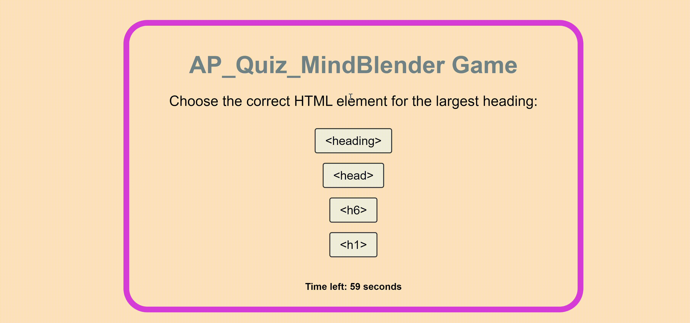

# Ap_Quiz_MindBender

## Description 
 This is a  web based quiz  game that challenges with html,css and javascript basic multiple choice questions.  SO, in this quiz game Users  have questions with 4 options , so users can select their answers, and the quiz tracks their score and the time taken to complete the quiz. 
 Whenever the user answers a question correctly, increment the correct answer count by 25 points.  If a user answers a question incorrectly, some time (10 seconds) will be subtracted from the timer. The final score and a list of previous scores with initials are displayed at the end of the quiz.

## Table of Contents

- [Ap\_Quiz\_MindBender](#ap_quiz_mindbender)
  - [Description](#description)
  - [Table of Contents](#table-of-contents)
  - [Technology used](#technology-used)
  - [Installation](#installation)
  - [Usage](#usage)
  - [Credits](#credits)
  - [License](#license)

## Technology used 

* Html 
* CSS
* JavaScript
* Jquery
  
  
## Installation

For doing this challenges , first i install the VS Code developer tool to edit and modify the starter code.Also, i use google chrome web browser to play  a quiz  game.

## Usage

1. clone the AP_Quiz_MindBender repository to your local machine.
2. Open the "index.html" file in your browser. 
3. Now, you can see the first page of the quiz game. CLick on the "Start Quiz here" button to start the quiz. you can see the questions with multiple options for answer. Answer each question the by clicking on the options. 
4. finally , you can view your final score. if you want to save your score, sign in with your initials there. 

* Here is the demo of  the project: 

## Credits
* i clone a starter code from this repository: [https://github.com/coding-boot-camp/friendly-parakeet.git]

* i watched this video for push the code from vs code to git hub and deployed at live .[https://www.youtube.com/watch?v=Ky_aUrzArt4]

* In this website , its very helpful to understand how to make a javascript quiz .[https://simplestepscode.com/javascript-quiz-tutorial/]

* I watched this video to learn how to save high scores and initials in local storage and retrieve them to final score page. [https://www.youtube.com/watch?v=DFhmNLKwwGw]

* i watched this video for timer .[https://www.youtube.com/watch?v=h_JrTmVnhw4]  [https://www.w3schools.com/js/js_timing.asp]

## License
N/A